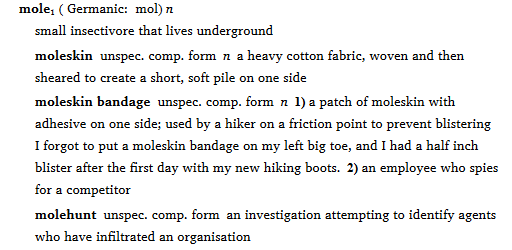

# Subentry Promotion
This repo contains scripts to process SFM lexical records to promote subentries to full entry records. The promoted entry has a marker (\mn) pointing back to the entry it was under.

FLEx imports subentries only at the entry level.  In order to import a subentry under a sense, it needs to be recast as a variant (rather than as a complex form) in the SFM file, and then imported, and then changed from Variant to Complex Form in the .fwdata file after the import.

This repository contains several scripts and control files needed for that process.  One of the scripts promotes embedded subentries to standalone entries (so they can retain all the fields that Complex Forms can have). Another script looks for these entries in the FLEx .fwdata file and changes them from Variant to Complex Form.  These scripts also include a mechanism to customize the complex form type.

A model SFM record with sub-entries, and its mapping file provide model entries. Import the SFM record into your FLEx database. You might need to customize the record and/or mapping file before importing it. Check and modify the language mapping assignments and sub-entry types to match your needs.

A Windows WSL bash wrapper script runs the Perl script that processes the FLEx database. It extracts the FLEx database file (*.fwdata*) from a FLEx backup file (*.fwbackup*). It runs the script to make the changes to the FLEx database and updates the backup file with the changed database file. The wrapper script requires that the Windows version of the *7-Zip* program be installed on the computer to do the extraction and update.

### Improper Subentry Import Example

In the sample file, the 1st homograph **mole1** has two senses, **1)** the small burrowing mammal and **2)** an enemy agent. The burrowing animal has a sub-entry *moleskin* and  *moleskin* has a sub-subentry of *moleskin bandage*. The enemy agent has a sub-entry *molehunt*. Here's the SFM record that represents that structure. For brevity, a few extraneous fields from the file have been removed. 
```
\lx mole
\hm 1
\sn 1
\ps n
\de small insectivore that lives underground
\se moleskin
\ps n
\de a heavy cotton fabric, woven and then sheared to create a short, soft pile on one side
\sese moleskin bandage
\ps n
\de a patch of moleskin with adhesive on one side
\sn 2
\ps n
\de an employee who spies for a competitor
\us jargon, espionage
\se molehunt
\de an investigation attempting to identify enemy agents

```

When it's run without the sub-entry promotion scripts, the FLEx SFM Import process puts all the sub-entries at the entry level, even if they should be under a sense. Any sense is taken as a sense of the previous entry or sub-entry.

For the above records, FLEx import interprets that main entry *mole* the burrowing animal has the following sub-entries, *moleskin, moleskin bandage,* and *molehunt*. The *moleskin bandage* has two senses, **1)** a patch of moleskin with an adhesive  (correct), and **2)**, an enemy agent (inocorrect).

Here's how that looks with basic FLEx formatting, and including the deleted fields:





and after the other *mole* homographs,


Here's what it looks like after the process, with the sub-entries corrected:


and  after the other *mole* homographs,


This repository was migrated from Wes Peacock's Nkonya dictionary Script directory in June 2019.
